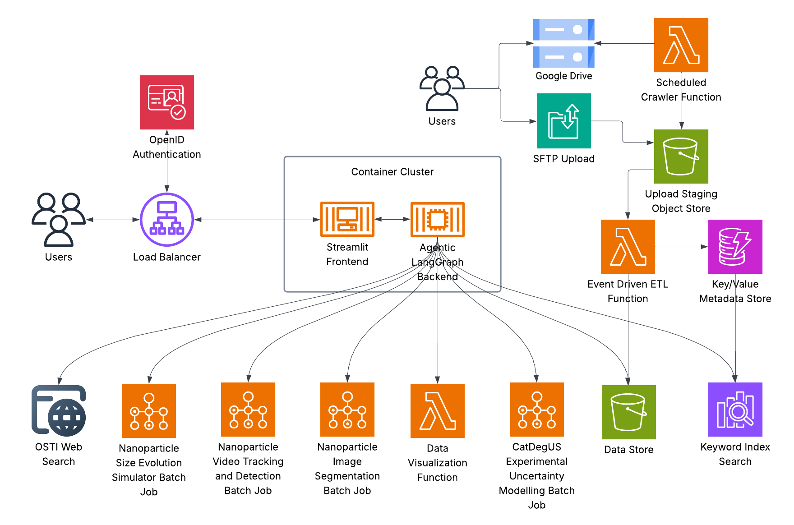
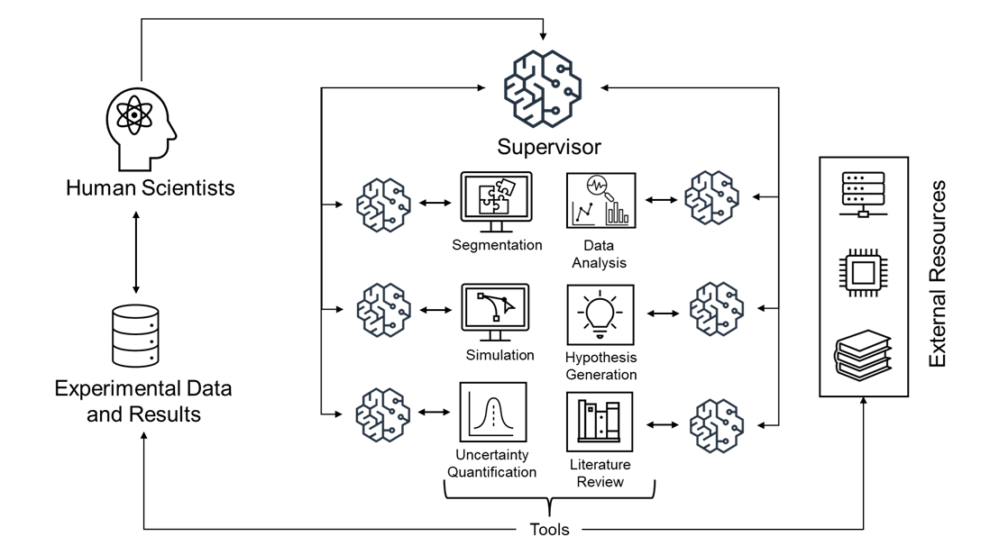

<p align="center">
  
</p>

# 03/11/2026 &mdash; AotW#9: LABMATE Supervisor &mdash; Multi-Agent Orchestrator for Catalysis Research

---

## Science Story

Accelerating catalysis research &mdash; the discovery of materials that drive chemical reactions more efficiently &mdash; requires integrating many different activities: reviewing literature, running simulations, analyzing microscopy data, generating hypotheses, and planning new experiments. In many labs, those activities are spread across separate tools and interfaces, which means researchers spend significant time manually coordinating handoffs and re-establishing context.

The LABMATE Supervisor Agent, developed at Pacific Northwest National Laboratory, addresses this by providing one conversational entry point that orchestrates six specialized agents across the catalysis workflow: literature review, simulation, segmentation, data analysis, hypothesis generation, and uncertainty-guided experiment design. The result is a more continuous research loop where scientists can move from question to evidence to next-step planning in one system.

<p align="center">
  
</p>
<p align="center"><em>End-to-end LABMATE workflow, from user interaction to orchestrated agent execution and scientific outputs.</em></p>

---

## Agentic Motivation

Without an orchestrating supervisor, researchers using multi-tool workflows must manually decide which tool to use for each step, transfer outputs between systems, and re-establish context after every transition. The LABMATE Supervisor Agent addresses these coordination bottlenecks through:

- **Intelligent request routing.** The supervisor interprets natural language requests and routes them to the most appropriate specialist agent (Researcher, Simulator, Segmenter, Analyzer, Hypothesizer, or ExperimentDesigner), relieving users from having to know which tool handles which task.
- **Conversation state checkpointing.** State is checkpointed using LangGraph MemorySaver, preserving context across multi-turn interactions so follow-up questions can reference prior results.
- **Multi-step workflow chaining.** The supervisor can chain sequential tasks across agents &mdash; e.g., searching literature, running a simulation, and generating a hypothesis based on combined results &mdash; in a single conversational exchange.
- **Human-in-the-loop integration.** The system is designed for deployment as a Streamlit web application, making agent capabilities accessible to experimentalists who do not write code.

Across evaluations reported by the LABMATE team, this architecture showed strong practical performance: 90% correct routing in synthetic invocation tests, 97.5% task completion on synthetic tasks, and 90.5% task completion on ChemBench prompts, with 61% correctness on ChemBench.

---

## Implementation

The LABMATE Supervisor Agent is built on LangGraph and deployed in a cloud-native architecture with a Streamlit user interface and FastAPI-backed services. The system uses an LLM-based supervisor to coordinate six domain-specialized agents and to route tasks to the right tools in real time. The reported implementation is model-flexible, with OpenAI o3-mini and Claude-family models used for different task types in the published system descriptions.

Key technologies and frameworks:
- **Orchestration:** LangGraph (supervisor graph with 6 sub-agents)
- **LLM stack:** OpenAI o3-mini (Azure OpenAI) and Claude-family models in published deployments
- **Memory:** LangGraph MemorySaver (conversation state checkpointing)
- **Web interface:** Streamlit (deployed at https://amcd.pnnl.gov/catalysis_copilot/)
- **Deployment:** AWS with PNNL on-premises authentication gateway

<p align="center">
  
</p>
<p align="center"><em>LABMATE architecture showing the supervisor-mediated routing pattern across six specialized agents.</em></p>

---

## To Know More

### Source Code
- **Repository:** Currently private (PNNL internal); public release expected soon

### Additional Resources
- **Website:** Currently private (PNNL internal)

#### Publication 1 (Conference Paper)
- **Link:** https://doi.org/10.1145/3731599.3767399
- **Plaintext citation:** Acharya, A., Sharma, A. K., Parker, D., Vega, T., Ashraf, R. A., Isenberg, N. M., Strube, J., & Rallo, R. (2025). *LABMATE: Language Model Based Multi-Agent System to Accelerate Catalysis Experiments*. In *Proceedings of the SC '25 Workshops of the International Conference for High Performance Computing, Networking, Storage and Analysis* (pp. 607&ndash;615). ACM. https://doi.org/10.1145/3731599.3767399
- **BibTeX:**

```bibtex
@inproceedings{acharya2025labmate,
  title={LABMATE: Language Model Based Multi-Agent System to Accelerate Catalysis Experiments},
  author={Acharya, Anurag and Sharma, Anshu Kiran and Parker, Derek and Vega, Timothy and Ashraf, Rizwan A. and Isenberg, Natalie M. and Strube, Jan and Rallo, Robert},
  booktitle={Proceedings of the SC '25 Workshops of the International Conference for High Performance Computing, Networking, Storage and Analysis},
  pages={607--615},
  year={2025},
  month={nov},
  publisher={ACM},
  doi={10.1145/3731599.3767399},
  url={https://doi.org/10.1145/3731599.3767399}
}
```

#### Publication 2 (Preprint)
- **Link:** https://arxiv.org/abs/2601.12607
- **Plaintext citation:** Acharya, A., Vega, T., Ashraf, R. A., Sharma, A., Parker, D., & Rallo, R. (2026). *A Cloud-based Multi-Agentic Workflow for Science*. arXiv:2601.12607. https://arxiv.org/abs/2601.12607
- **BibTeX:**

```bibtex
@article{acharya2026cloudbased,
  title={A Cloud-based Multi-Agentic Workflow for Science},
  author={Acharya, Anurag and Vega, Timothy and Ashraf, Rizwan A. and Sharma, Anshu and Parker, Derek and Rallo, Robert},
  journal={arXiv preprint arXiv:2601.12607},
  year={2026},
  url={https://arxiv.org/abs/2601.12607}
}
```

- **Contact:** Anurag Acharya &mdash; anurag.acharya@pnnl.gov; Robert Rallo &mdash; robert.rallo@pnnl.gov (Pacific Northwest National Laboratory)

---

*Last Updated: 03/11/2026*
*Contributed by: Anurag Acharya, Robert Rallo (Pacific Northwest National Laboratory)*
