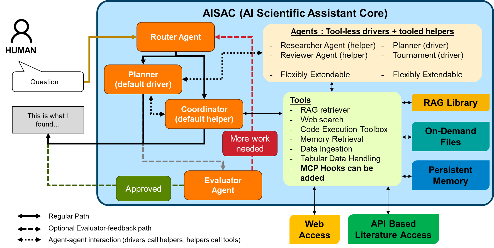
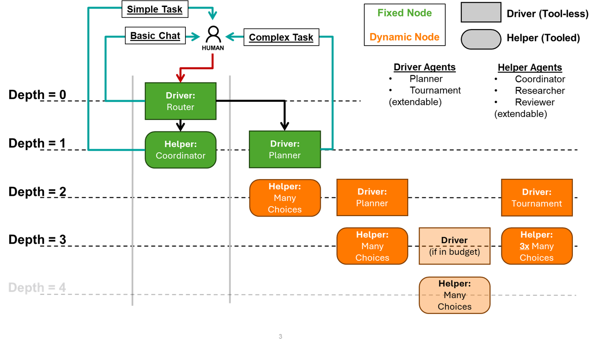

<p align="center">
  
</p>

# 04/07/2026 &mdash; AotW#6: AISAC &mdash; AI Scientific Assistant Core

> **AISAC is under active development.** New capabilities, integrations, and HPC-specific features are continuously being added.

---

## Science Story

Scientific researchers working on HPC environments face a persistent bottleneck: translating
domain expertise into computational workflows requires navigating heterogeneous systems,
specialized tools, and large bodies of literature simultaneously — often across separate
sessions and tools. AISAC (AI Scientific Assistant Core), developed at Argonne National
Laboratory, addresses this by providing a unified natural-language interface through which
researchers can search and synthesize scientific literature (arXiv, PubMed), execute and
debug analysis code, query domain-specific knowledge bases, analyze structured datasets, and
orchestrate complex multi-step HPC workflows — all within a single session. AISAC is
domain-agnostic by design: the same core framework powers a general science assistant and
specialized domain agents (combustion CFD, materials science, computational biology) simply
by layering project-level extensions on top. It has been deployed on ALCF Aurora and Improv
for workflows spanning materials science, climate modeling, and computational biology.

<p align="center">
  
</p>

---

## Agentic Motivation

Traditional scientific computing requires researchers to manually coordinate across
disconnected tools: literature search engines, notebooks, HPC job schedulers, and knowledge
bases. Each handoff is a friction point. Multi-step analyses — retrieve relevant papers,
extract methods, adapt code, run on HPC, interpret results — are error-prone and slow when
performed sequentially by hand. Non-agentic LLM chatbots fall short too: they lack persistent
state, cannot invoke real tools, and produce unverifiable outputs with no execution trace.

AISAC's agentic design directly addresses each of these gaps:

- **Autonomous multi-step planning:** A Planner agent decomposes complex research queries
  into ordered, verifiable steps and delegates each to specialized helpers — enabling
  workflows that would otherwise require hours of expert manual coordination.
- **Adaptive routing:** A Router classifies every query and selects the minimum-cost
  execution path (direct answer, retrieval, planning, or tool use), avoiding unnecessary
  compute while ensuring complex tasks get full multi-agent treatment.
- **Tool integration at scale (50+ built-in tools):** Agents can invoke web search,
  arXiv/PubMed literature retrieval, hybrid RAG over institutional documents, safe
  stateful code execution, structured data analysis, vision, file operations, and corpus
  management — all without human intervention between steps.
- **Shared working memory (Blackboard):** A database-backed shared workspace lets agents
  accumulate intermediate findings, build structured reports, and track conclusions across
  successive steps — without inflating individual agent prompts or leaking internal reasoning
  between agents. All writes are attributed and timestamped for full provenance.
- **Cross-agent collaboration via MCP:** AISAC agents can discover and invoke external
  specialized agents registered in the Academy exchange — including agents running on Aurora,
  Improv, or partner laptops — supporting federated scientific workflows across institutional
  boundaries.
- **Long-horizon session memory:** Persistent SQLite + FAISS memory scoped per user and
  agent enables coherent multi-session research workflows. Agents accumulate learned user
  preferences and prior findings and apply them in future sessions.
- **Runtime user oversight:** Users retain live control — they can stop execution, force
  early synthesis of partial results ("Answer Now"), or inject a note into the active
  agent's context without interrupting the workflow ("Interject").
- **Clarification with graceful timeouts:** Agents can request user clarification at
  configurable severity levels — from auto-resolving low-priority queries (60s timeout) to
  blocking high-priority ones until the user responds — preventing runaway execution without
  sacrificing throughput.

---

## Implementation

AISAC is implemented in Python 3.10+ (~35,000 LOC) as a layered multi-agent system with a
strict driver–helper separation. Projects inherit everything from the core and extend it via
opt-in overrides — custom tools, custom agents, domain-specific RAG corpora — without
touching the framework.

---

### Agent Architecture

**LangGraph state machine with recursive depth-bounded execution:**

```
Depth 0: Router      → classifies intent: direct | plan | retrieve | tool
Depth 1: Planner     → decomposes query into ordered steps (no tool access)
Depth 1: Coordinator → executes plan steps, dispatches helpers
Depth 2: Helpers     → RAG Retrieval | Code Execution | Web/Literature Search | Data Analysis
```

Drivers (Router, Planner, Coordinator) operate on the **control plane** — they reason and
orchestrate but never call tools directly. Helpers operate on the **work plane** — they
execute tools and return structured results. This separation enforces traceability and
prevents uncontrolled tool use by reasoning agents.

Safety limits are hard-enforced: `MAX_TURNS=8`, `MAX_TOOL_ROUNDS=80` (soft warn at 70),
`MAX_DRIVER_DEPTH=2`. Context is monitored continuously: RAG is tapered at 70% utilization
and execution halts at 95%.

<p align="center">
  
</p>

---

### Full Tool Catalog (50+ Built-In Tools)

#### Research & Literature
- `web_search` — DuckDuckGo with domain filters, pagination, and content extraction
- `arxiv_search` — Semantic preprint search via Atom API with citation export
- `pubmed_search` — Biomedical literature via NCBI E-utilities with structured results
- `fetch_url` — Direct URL retrieval with HTML-to-text conversion

#### Retrieval-Augmented Generation (RAG)
AISAC runs two independent RAG systems simultaneously:

**Base Knowledge Store** (persistent, project-level):
- Hybrid search: Tantivy BM25 (lexical) + FAISS (semantic), score-normalized and blended
- Incremental indexing with MD5 hash-based change detection — only re-indexes changed files
- Supports PDF, DOCX, PPTX, TXT, Markdown
- Extracts and indexes **embedded tables** from PDF/DOCX as typed chunks (caption-detected)
- Extracts and indexes **embedded images** from PDF/DOCX; optional vision-LLM descriptions
  at index time for semantic image search
- `./local_corpus/` auto-include — drop files in a folder and they are indexed at startup,
  no config edits required

**On-Demand Store** (per-query, ephemeral):
- Agents ingest user-uploaded or referenced documents at query time
- Independent from the main knowledge base; discarded after the session

RAG tools:
- `rag_query` — Hybrid search with `scope` (global/agent/both), MMR reranking, K control
- `corpus_read_file` — Read a corpus file directly (modes: text, table, image, references)
- `corpus_list_files` — List all indexed files with metadata
- `corpus_glob` — Find corpus files by glob pattern
- `corpus_grep` — Full-text regex search across the entire corpus

#### Data Analysis (DataFrame Registry)
- `filesvc_open_table` — Load CSV, TSV, TXT, JSON, Parquet, XLSX, XLS, XLSM (8 formats);
  modes: `summary` (preview) or `attach` (register a `df_id` for further operations)
- `filesvc_open_document` — Extract text from PDF, DOCX, PPTX, TXT, MD, PY
- `df_preview` — Head/tail/schema inspection
- `df_stats` — Statistical summaries, null counts, distributions
- `df_query` — Pandas query DSL execution on registered DataFrames
- `df_list` — List all active DataFrame handles
- `df_to_session` — Inject a registered DataFrame into a stateful code session
- Auto-header detection (probes up to 8 rows), blank→NaN coercion, delimiter inference

#### Code Execution Engine
- `execute_code` — Stateless single-shot Python execution with stdout/stderr capture
- `code_session_start` — Create a stateful IPython-style session with controlled import
  allowlist (math, statistics, pandas, numpy, openpyxl; optional: scipy, sklearn,
  matplotlib, seaborn)
- `code_session_exec` — Execute code with variable persistence across calls
- `code_session_end` — Terminate session and release resources
- `code_session_query_namespace` — Inspect live session variables

All code execution uses an AST-parsed import + call allowlist before execution.
Forbidden: `os.system`, `eval`, `exec`, `__import__`, subprocess calls.

#### Vision
- `vision_describe_images` — Describe uploaded or corpus images using a vision LLM

#### Memory & State
- `memory_retrieve` — Semantic search over past conversation turns
- `blackboard_write` / `blackboard_read` / `blackboard_append` / `blackboard_patch` —
  Shared mutable workspace across all agents within a task, with provenance attribution
- `user_preferences_get` / `user_preferences_set` — Long-term user preference learning

#### File & System Operations
- File read, write, list, search, move, delete (within allowed project scope)
- Directory listing with metadata

#### MCP (Model Context Protocol)
- `invoke_mcp_agent` — Discover and call any agent registered in the Academy exchange;
  long-call timeout (2 hours) to accommodate HPC-backed agents
- Agent discovery cache refreshed every 180s
- Parameter schemas extracted automatically from partner docstrings

---

### Observability & UI

AISAC's Gradio interface includes a live **Inspector** with dedicated panes for Router,
Planner, and Coordinator — showing reasoning, decomposition steps, and delegation decisions
in real time via `@gr.render`. A compact trace timeline and full action log are also
surfaced alongside the chat. Every trace event is faithful: snapshots use the exact message
list sent to the LLM, ensuring audit accuracy.

An optional **Evaluator** agent provides automated quality scoring with multi-round
refinement (configurable thresholds; off by default). A **Conversation History sidebar**
lets users browse and resume past sessions backed by the SQLite store.

---

### Deployment & Extensibility

| Environment | How |
|---|---|
| Windows / macOS desktop | AISAC Manager (tkinter + pywebview) — native window per project |
| Linux / HPC login node | Terminal launcher + SSH tunnel |
| Air-gapped | `OFFLINE_MODE` — local models, no outbound calls |

**LLM providers** (all behind a unified `call_llm()` with probing and failover):
Argo Legacy/Public (ANL), ALCF Sophia, OpenAI, AMSC (via LiteLLM), local models.

**Auth:** Globus PKCE flow for ALCF — no stored secrets.

**Project extension model:** Projects are 5-line `main.py` files that opt into overrides
via boolean flags — `USE_LOCAL_TOOLS`, `USE_LOCAL_AGENT_REGISTRY`, `USE_LOCAL_GRAPH` —
adding domain tools and agents without touching core framework files.

---

## To Know More

### Source Code
- **Repository:** Available internally via Argonne National Laboratory GitLab
- **License:** Copyright &copy; Argonne National Laboratory, UChicago Argonne LLC. All rights reserved.

### Additional Resources
- **Paper:** Bhattacharya, C., & Som, S. (2025). *AISAC: An Integrated Multi-Agent System
  for Transparent, Retrieval-Grounded Scientific Assistance.* [arXiv:2511.14043](https://arxiv.org/abs/2511.14043)
- **Contact:** Chandrachur Bhattacharya &mdash; cbhattacharya@anl.gov

---

*Last Updated: April 2026*  
*Contributed by: Chandrachur Bhattacharya, Argonne National Laboratory*
